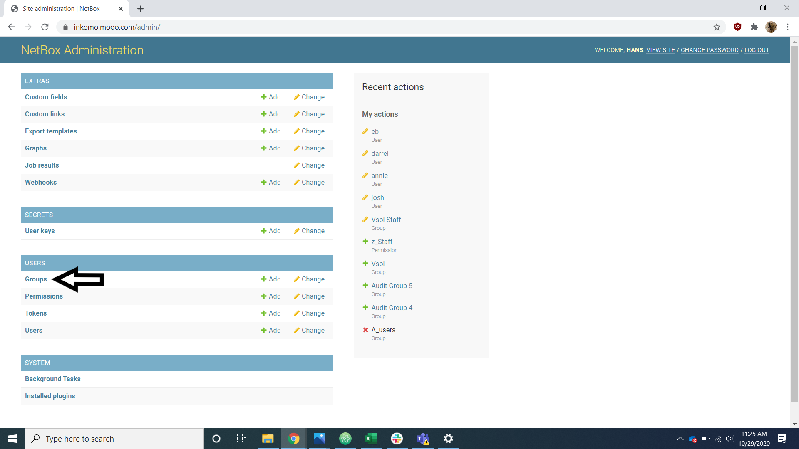
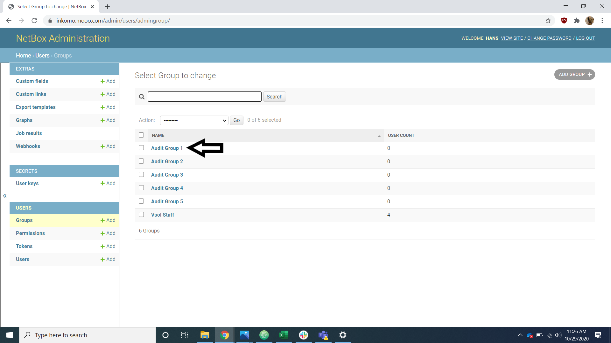
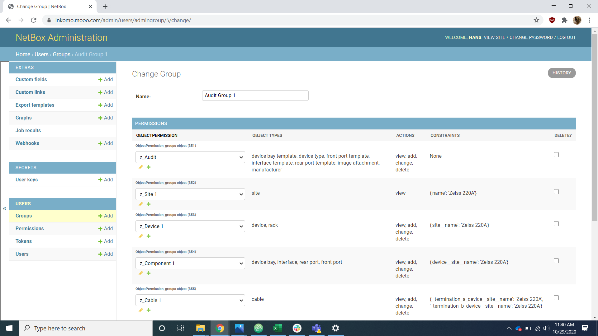
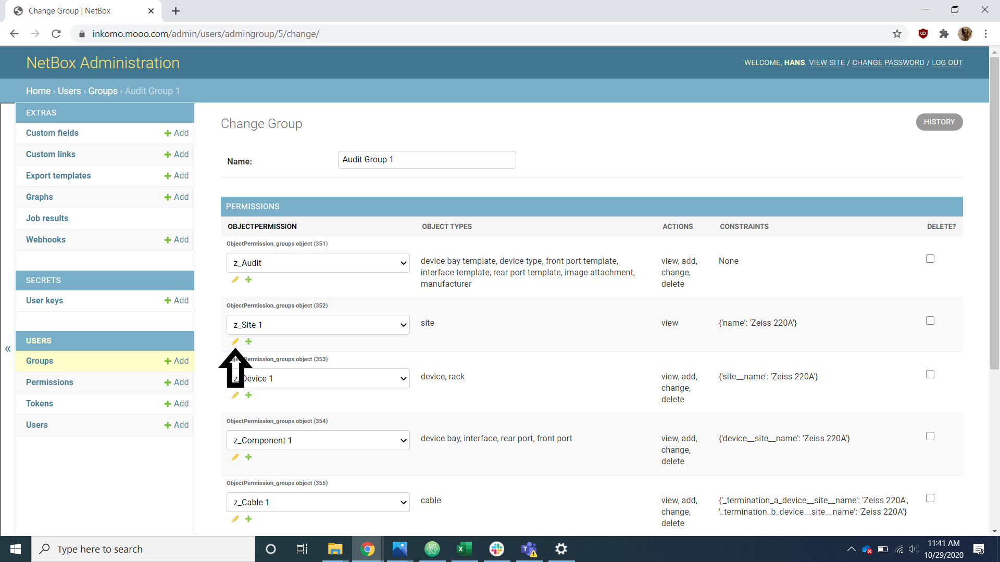

# Audit Access

When planning for a data center audit with Peripety, one of the steps is to assign and update an audit group for the site that is being audited. This will restrict the accounts assigned to this group to only the site being audited and give access to any other important audit related information.

## Audit groups

Navigate to the user groups section of the admin page.

Select an audit group from the list that you wish to use as the audit group for your site.

## The Five Permissions

Here is an example of a completed audit group which will serve as your reference for adding the site specific permissions.

The first permission in this list, z_Audit, provides users with access to all the parts of the site needed to complete the audit outside of those requiring site restrictions and therefore doesn't need any customization for each site.

You will have to change the other four permissions to reflect your site.

## Edit Permission Process

Select the edit button

Scroll to the constraints section at the bottom of the edit screen.

Type the site name exactly how it appears in Peripety into the text area where the previous site name appears and submit the change.

Repeat this for the rest of the permissions making sure to only thing being changed is the site name in the constraints section.

Once the permissions have been changed, change the audit group name to reflect the site/project the group is working on.
