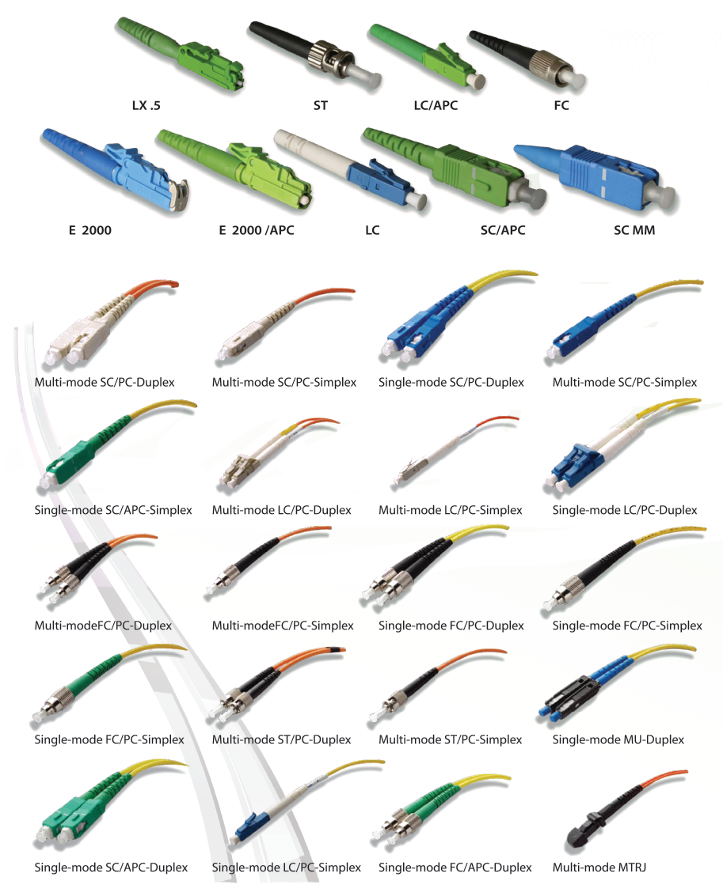

This document is provided to assist in identifying cable types and connectors as part of the audit process.

##Further Reading: 
[Optical fiber connector - Wikipedia](https://en.wikipedia.org/wiki/Optical_fiber_connector)

