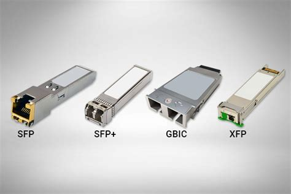
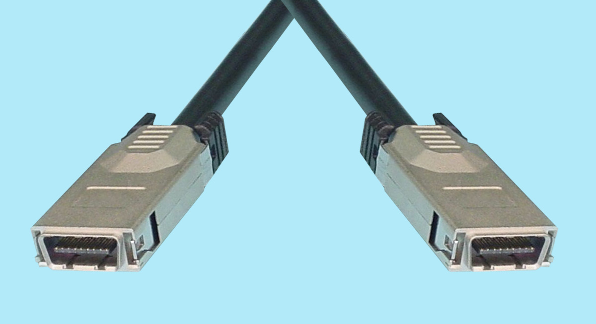
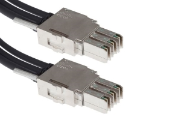

# Connectors

This page provides links and examples of connectors.

## SFP Examples

## Other Examples:

## InfiniBand (IB)

InfiniBand (IB) is a computer networking communications standard used in high-performance computing that features very high throughput and very low latency. It is used for data interconnect both among and within computers. InfiniBand is also used as either a direct or switched interconnect between servers and storage systems, as well as an interconnect between storage systems.

As of 2014, it was the most commonly used interconnect in supercomputers. Mellanox and Intel manufacture InfiniBand host bus adapters and network switches, and, in February 2016, it was reported that Oracle Corporation had engineered its own InfiniBand switch units and server adapter chips for use in its own product lines and by third parties. Mellanox IB cards are available for Solaris, FreeBSD, RHEL, SLES, Windows, HP-UX, VMware ESX, and AIX. It is designed to be scalable and uses a switched fabric network topology.

As an interconnect, IB competes with Ethernet, Fibre Channel, and Intel Omni-Path.

## Cisco StackWise

Cisco’s access layer switches used to be all separate physical switches where we use Ethernet cables for connectivity between the switches. Cisco Stackwise changed this, it allows us to turn multiple physical switches into a single logical switch.

Switches that support Stackwise use a special stacking cable to connect the switches to each other. Each switch has two stacking connectors that are used to “daisy-chain” (loop) the switches together. Each switch is connected to the one below it and the bottom switch will be connected to the one on top.

The Stackwise cable is like an extension of the switching fabric of the switches. When an Ethernet frame has to be moved from one physical switch to another, the Stackwise “loop” is used. The advantage of using a cabled loop is that you can remove one switch from the stack, the loop will be broken but the stack will keep working.

## Sundry generic connection types.

Here is a picture of some arbitrary generic connectors which may be helpful.

## Further reading:

[Wikipedia - SFP ](https://en.wikipedia.org/wiki/Small_form-factor_pluggable_transceiver)

[Cables To Go Tranceivers](https://www.cablestogo.com/category/data-com-transceivers)

