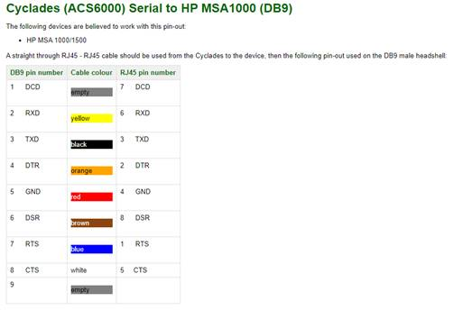

# Bespoke cable construction and pinouts

## DB9 Serial to RJ45 

This document is provided to assist in identifying cable pinouts for constructing cables and connectors.

The diagram below is what worked for connecting an Infoblox console port to an RJ45 network cable.

 
## Further Reading:

[All Pinouts](https://allpinouts.org/)
