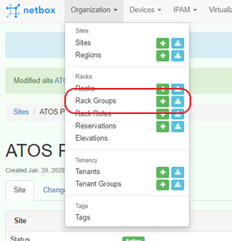
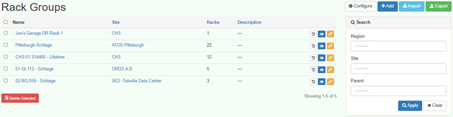
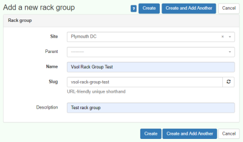
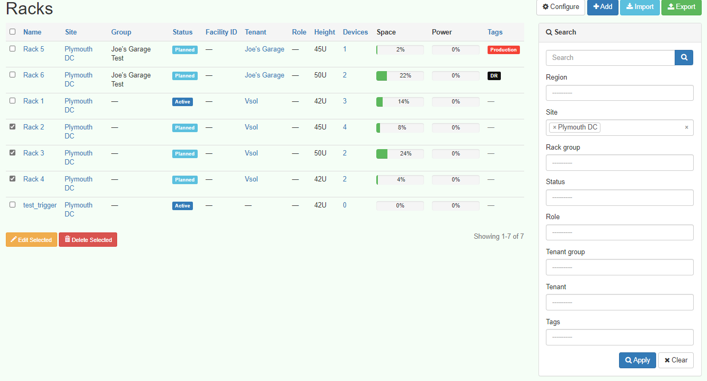
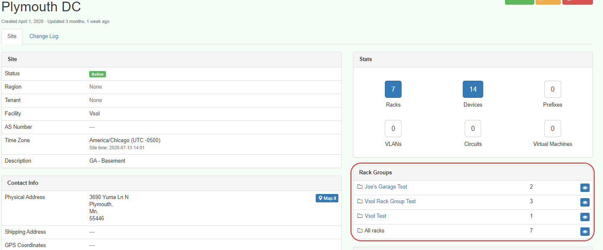

# Sites, Cages & Rack Groups

Sites are data center facilities which are often multi-tenanted.  Tenants are often separated into physical security cages, or rack groups. In peripety, this requires the site be set up as a parent with the various tenant facilities identified either by a unique facility, cage, or rack ID. These are represented as Rack Groups and are assigned to the appropriate tenant.

## Create Rack Group Process

## Rack Group

## Add rack group as follows:

## Assign Racks To Group
Add existing racks to groups. If this is initial site setup racks can be added to the newly created group by clicking the Add or Import buttons and supplying the approriate infrmation.  If the racks already exist, they need to be assigned to the group by editing their group assignment.

## Added Rack Groups

Result of rack group addition and association.

