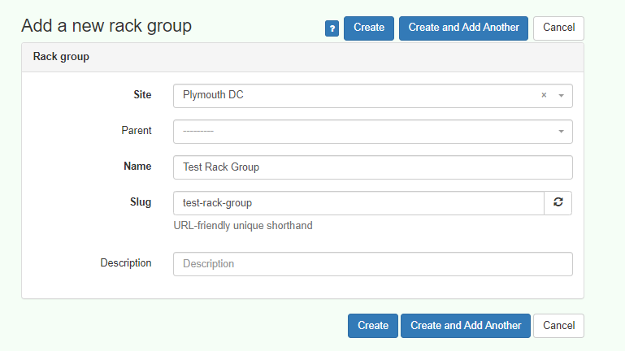

# Sites, Cages & Rack Groups

Sites are data center facilities which are often multi-tenanted.  Tenants are often separated into physical security cages, or rack groups. In peripety, this requires the site be set up as a parent with the various tenant facilities identified either by a unique facility, cage, or rack ID. These are represented as Rack Groups and are assigned to the appropriate tenant.

## Create Rack Group Process

## Rack Group

## Add Rack Group 
Add and assign rack group appropriately

## Add Rack Group 
Add and assign rack group appropriately

