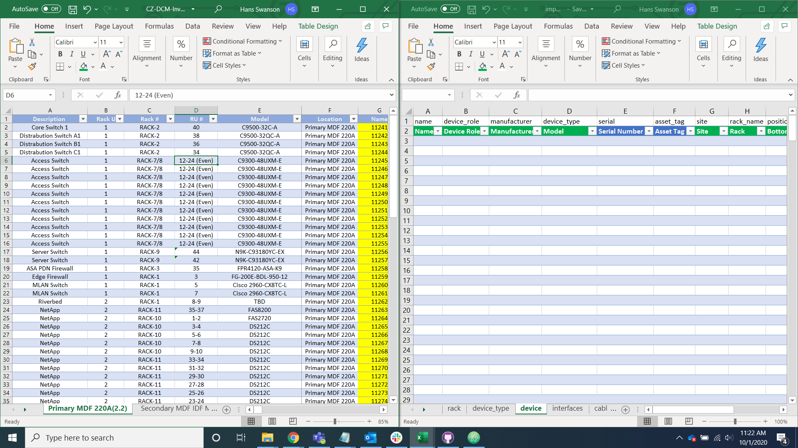
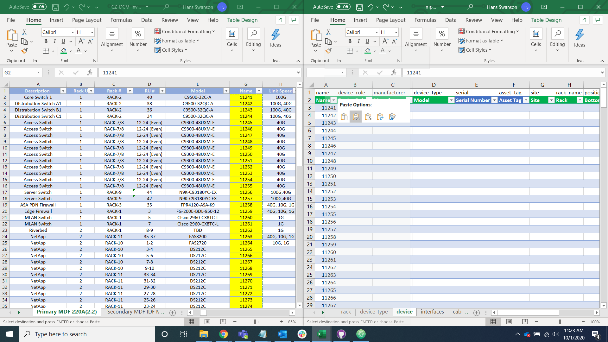

# Data Transfer

## Put Data Into Import Helper Spreadsheet

The first step of our import is to transfer the data provided by the client into our import helper spreadsheet in order to break the data down into its constituent parts. We ask the client to provide us with a device and a cable data sheet.

Open the import helper spreadsheet alongside the client data you have been provided.

Transfer the data into the import helper spreadsheet by pasting the information into its respective rows in the device and cable tabs.

