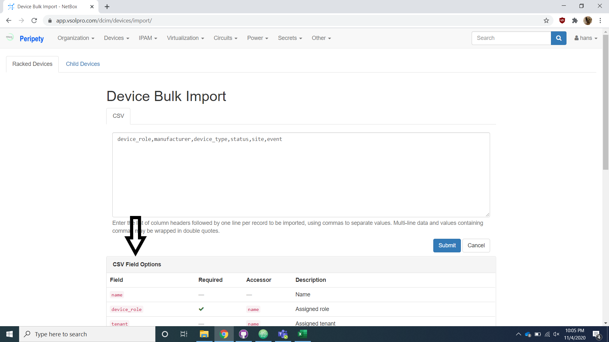

# Data Transfer

## Put Data Into Import Helper Spreadsheet

The first step of our import is to transfer the data provided by the client into our import helper spreadsheet in order to break the data down into its constituent parts. We ask the client to provide us with a device and a cable data sheet.

Open the import helper spreadsheet alongside the client data you have been provided.

Transfer the data into the import helper spreadsheet by copy and pasting the information into its respective rows in the device and cable tables. The spreadsheet has verbose headers on these two tables to aid in the transfer process.

When going through the upload process the columns with green headers are required, and the columns with blue headers are optional.

Refer to the CSV field options section of each models respective import page for field descriptions and options.

Current Device Role options can be found [here](https://app.vsolpro.com/dcim/device-roles/). All devices must have a device role from this list.

Device U Height in the device table is red because it is important to fill out to aide in adding device types but is not included when copying over the device data in the device level import.
