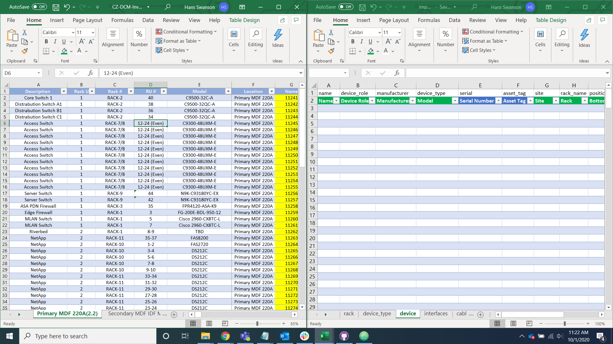
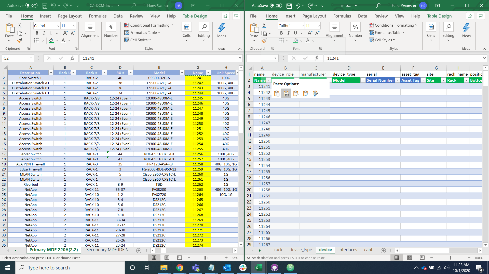

# Data Transfer

## Put Data Into Import Helper Spreadsheet

The first step of our import is to transfer the data provided by the client into our import helper spreadsheet in order to break the data down into its constituent parts. We ask the client to provide us with a device and a cable data sheet.

Open the import helper spreadsheet alongside the client data you have been provided.

Transfer the data into the import helper spreadsheet by copy and pasting the information into its respective rows in the device and cable tabs.

When going through the upload process the columns with green headers are required, the columns with blue headers are optional, and the columns with red headers are context data that should not be uploaded but is useful to fill out to help with populating other fields.
