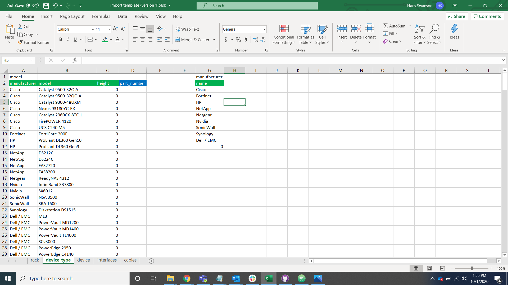
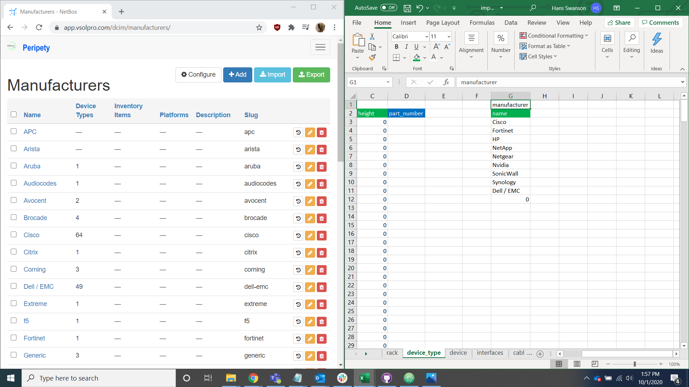
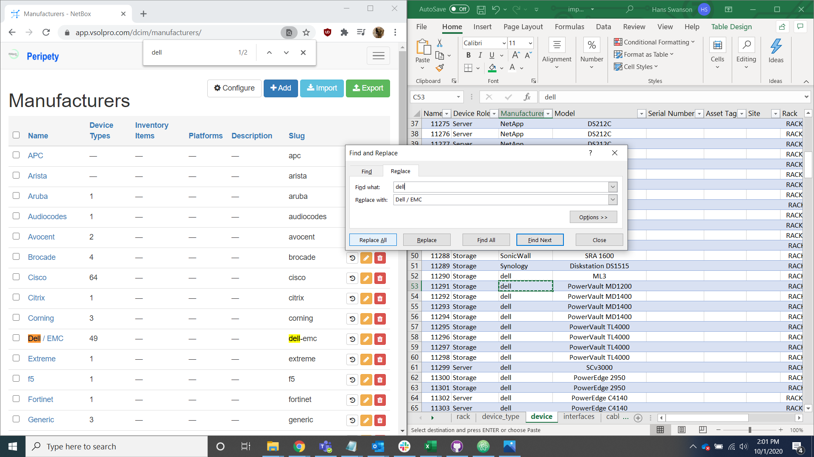
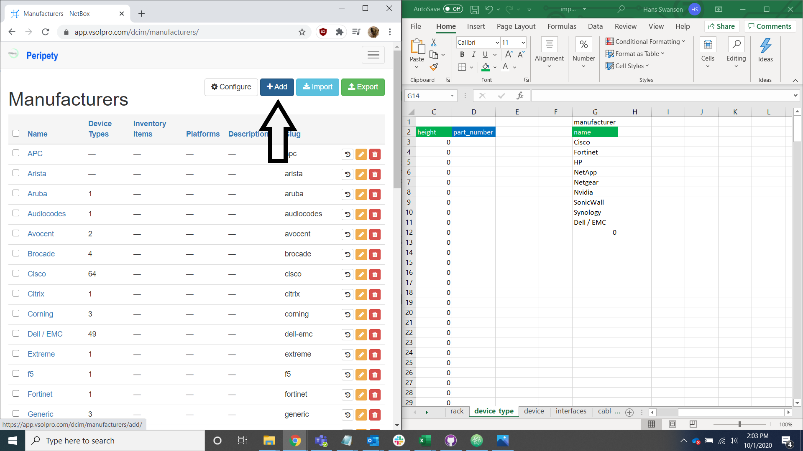
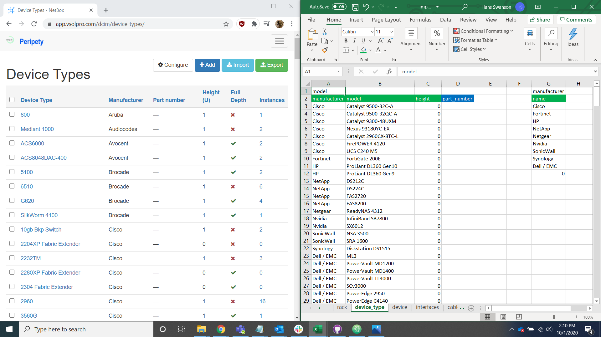
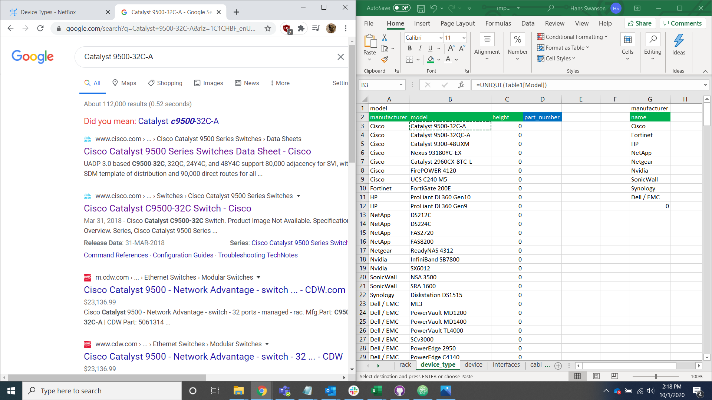
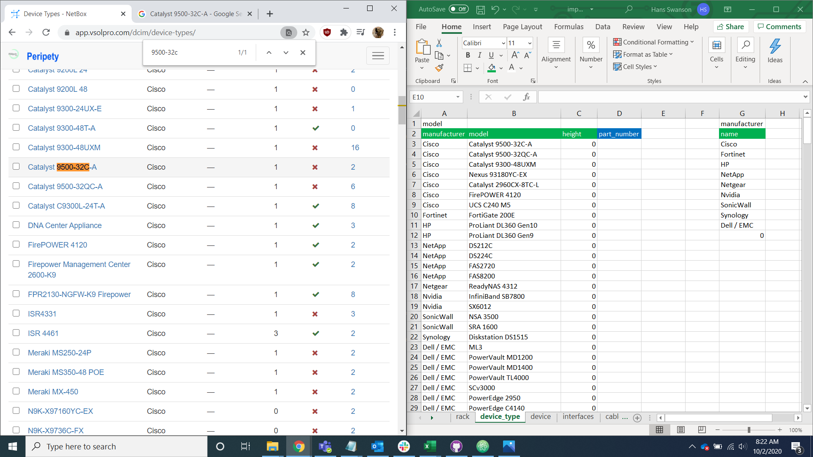
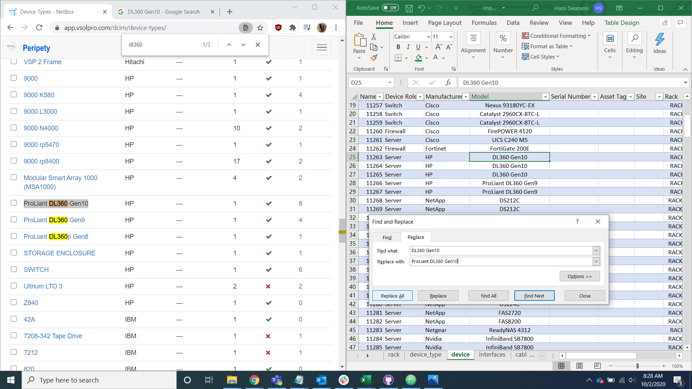
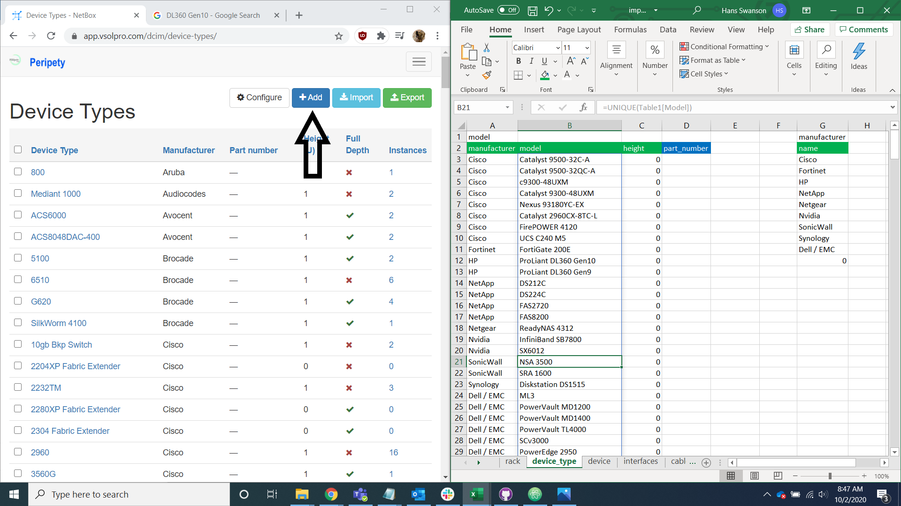

# Device Type Import

## Manufacturers

The first step of importing the data into Peripety is to update the device type library with any undocumented makes and models. Navigate to the manufacturer list in the device_type tab of the import helper spreadsheet.

Open Peripetys manufacturer table alongside the device_type tab and compare the data.

Search the manufacturer page for the manufacturer name.

For manufacturers that already exist in Peripety, check the spelling and formatting and change data in the device tab to reflect existing Peripety data.

For manufacturers not in Peripety, add them to the database and change the data in the device tab to reflect existin Peripety models and spelling.

## Device Types/Models

Locate the model list.

Open Peripety's device type table alongside the spreadsheets device_type tab.

Often the model name provided by the client is not the full model name so it is important to research the correct name if you don't know what the full name is off hand.

Search the device type page for the full model name by using ctrl + F or the search bar.

For device type models that already exist in Peripety, check the spelling, formatting, and U height and change the data in the device tab to reflect Peripety's models.

For models not in Peripety, add them to the database and change the data in the device tab to reflect Peripety's models and spelling.

