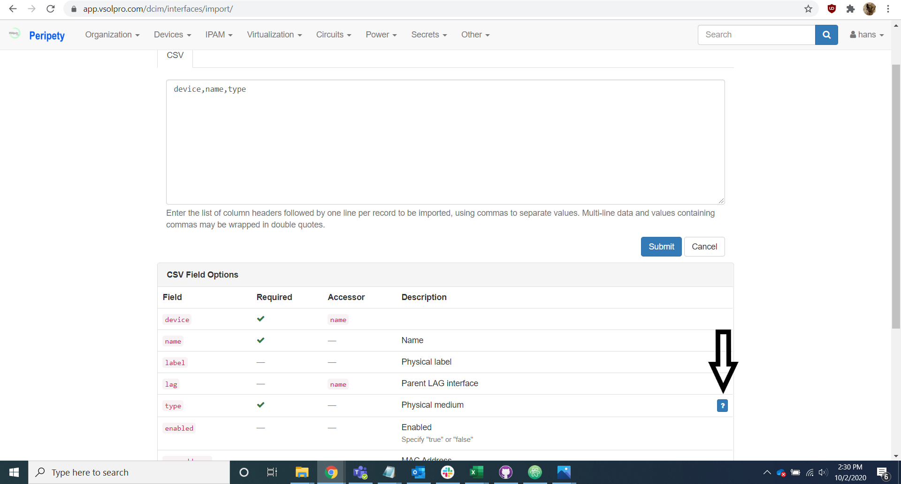

# Interface and Cable Import

## Interface

Navigate to the interfaces tab of the import helper spreadsheet.

Add the physical type for each interface in the sheet.

The quick select options for type are:

* Ethernet
* Single Mode Fiber
* Multi Mode Fiber
* Coax
* Telco
* Serial

This should be decided by referring to the cable type for each port.

For other interface type options, refer to the csv field options section of the interface import page of Peripety.

Copy the A side and B side information into a new excel spreadsheet and save it as a csv file.

Open the file with notepad, copy it into the interface import page on Peripety, and select the import button.

## Cable

Navigate to the cable tab of the import helper spreadsheet.

Make any corrections necessary to align the cable types provided by the client with the cable types in Peripety. For the cable type options, refer to the csv field options section of the cable import page of Peripety.

Copy the cable tab into a new excel spreadsheet.

Remove the verbose headers in the second row.

Save the data as a csv file.

Open the file with notepad, copy it into the rack import page on Peripety, and select the import button.

