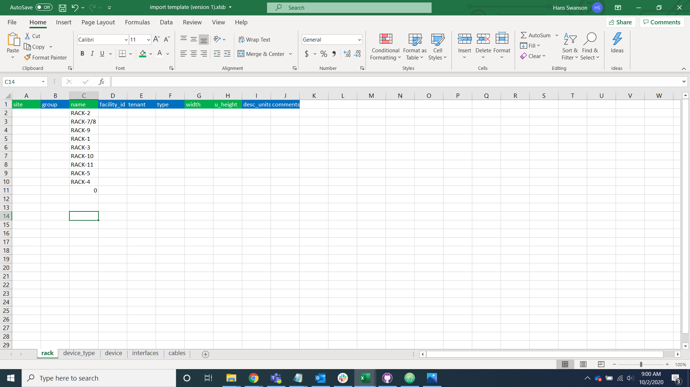
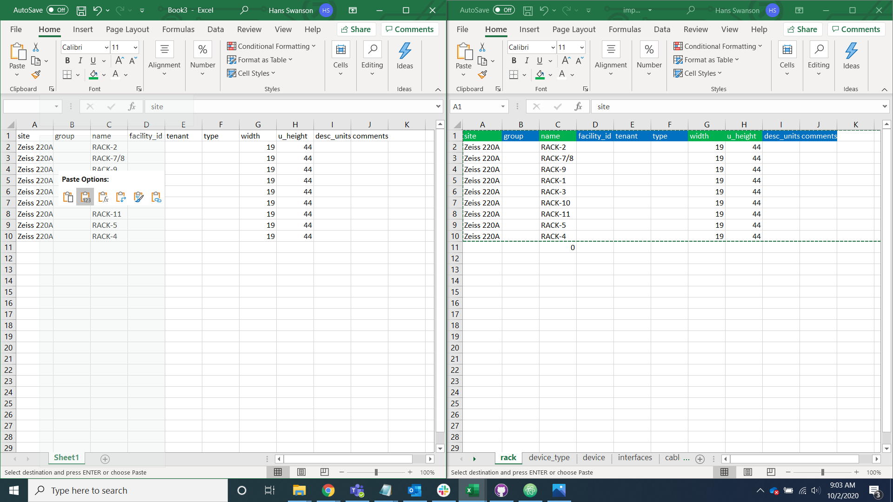
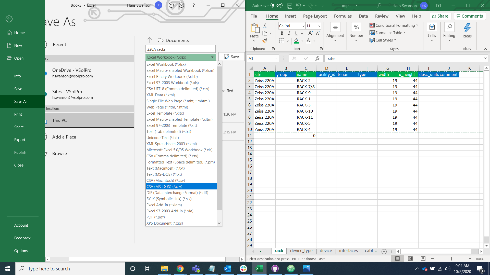
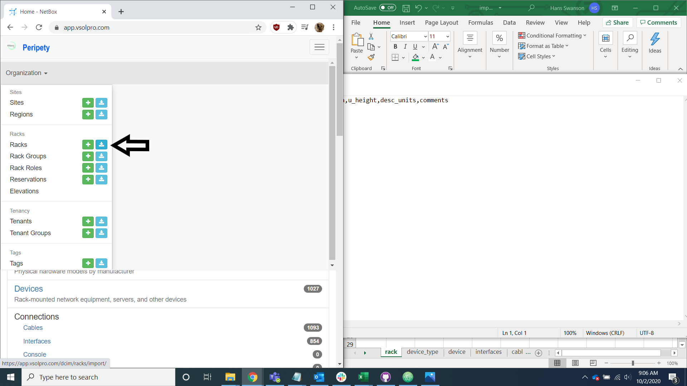
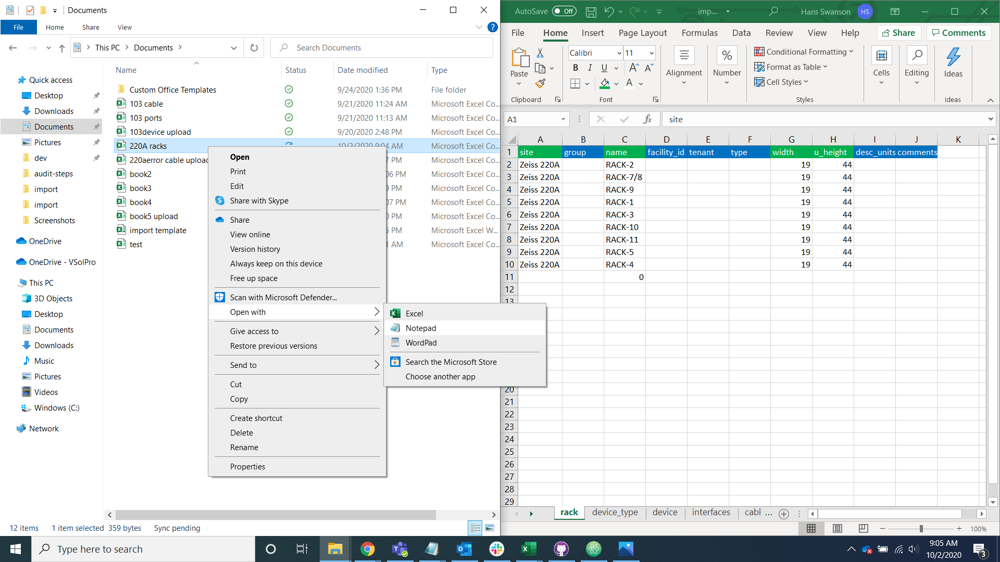
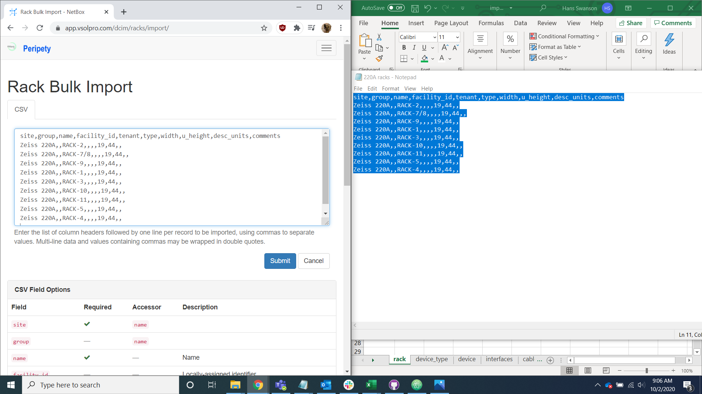
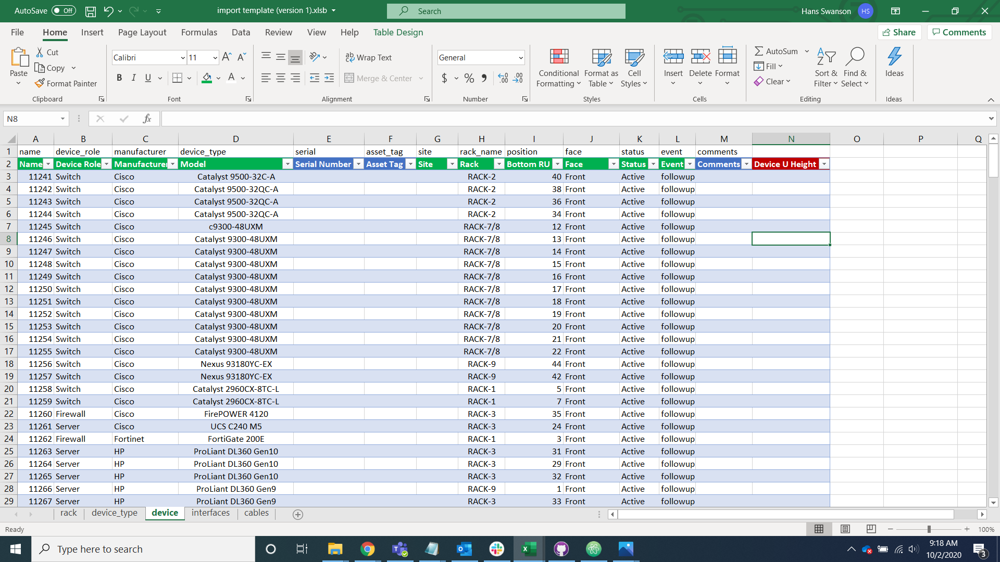
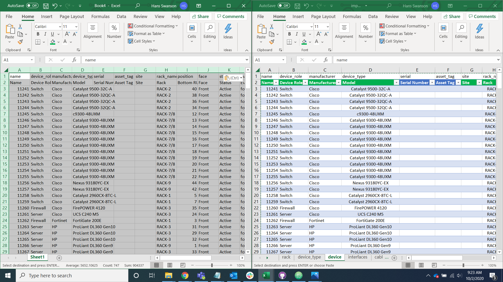
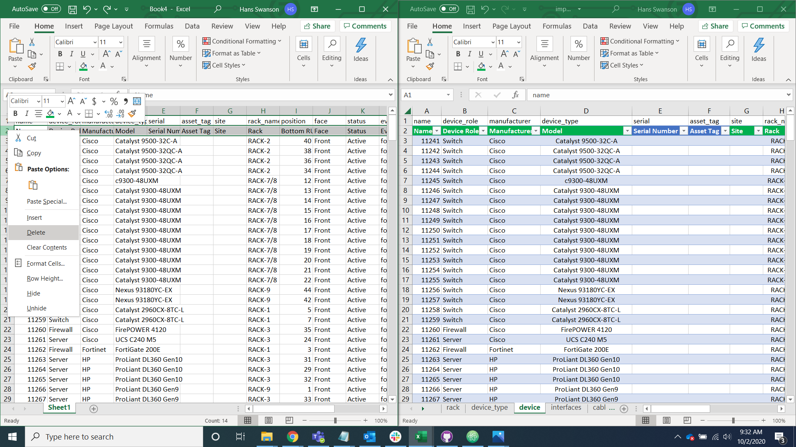
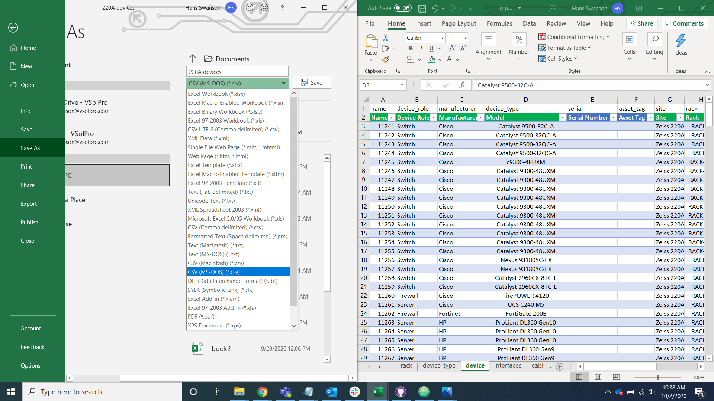

# Rack and Device Import

## Rack

Navigate to the rack tab of the import helper spreadsheet.

For each rack add the required information:

* site: Which site the racks are in.
* width: Rail-to-rail width (in inches). If unknown, put 19.
* u_height: Height in rack units. If unknown, put 42. Check the device tab and see what the highest occupied ru of any rack. If that value is larger than 42 and set that as the height for all racks.

Copy the rack tab into a new excel spreadsheet and save it as a csv file.

Navigate to the rack import tab of Peripety

Open the file with notepad, copy it into the rack import page on Peripety, and Select the import button.

## Device

Navigate to the device tab of the import helper spreadsheet.

For each Device add the required information:

* site: Which site the devices are in.
* status: Operational status. If unknown, put active.
* event: Move event. If unknown, put followup.

Copy the Device tab into a new excel spreadsheet.

Remove the verbose headers in the second row.

Save the data as a csv file.

Open the file with notepad, copy it into the device import page on Peripety, and Select the import button.

