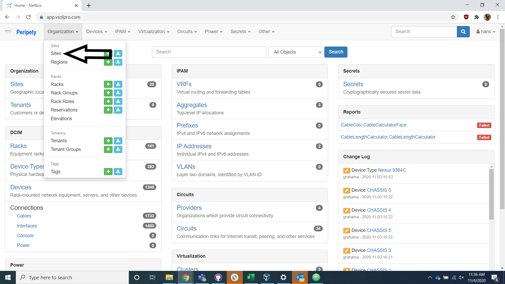
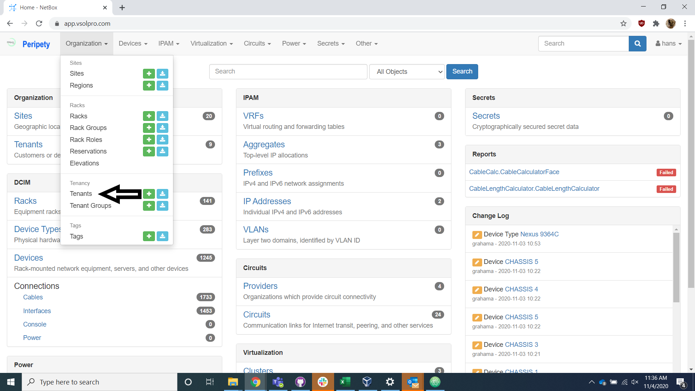

# Site and Tenant

Any data that you import into Peripety must fit into the relationships of the database. The highest level of Peripetys parent child relationships are the records for site and tenant. These fields must be populated before proceeding with the creation of any other records.

## Site

Navigate to the site page of Peripety.

Check the site list to ensure that the site you are going to add does not already exist in Peripety.

If the site does exist, check that someone else has not already created the devices that you are attempting to import.

If the site is not on the list, add it to the record.

## Tenant

Navigate to the tenant page of Peripety.

Check the tenant list to ensure that the client you are going to add does not already exist in Peripety.

If the tenant is not on the list, add it to the record.
